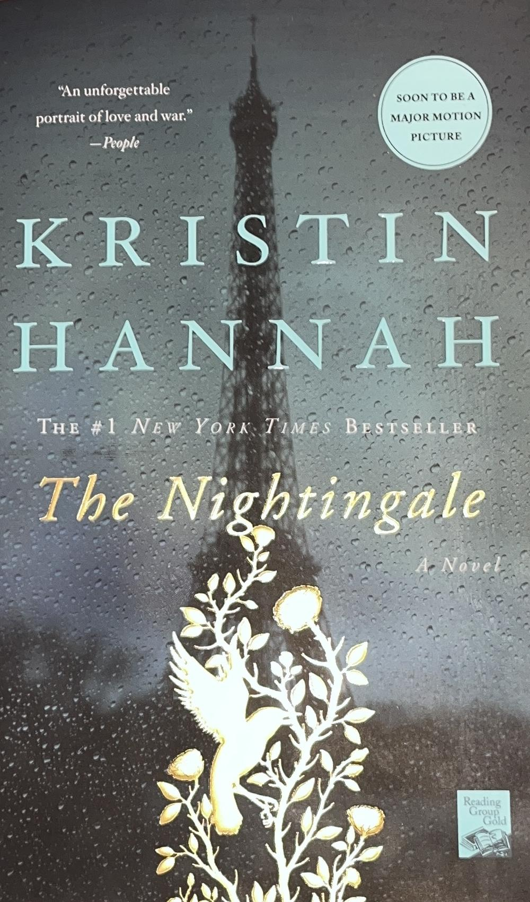

# monocle
A command-line tool written in Python for automatically cropping images (with an emphasis for books).

<table>
</thead>
<tbody>
</tbody>
	<tr>
		<td>
			<br />
			Original Image
		</td>
		<td>
			<br />
			Chunks Colored In
			(Debug Flag Used)
		</td>
		<td>
			<br />
			Background Detection in Chunks
			(Debug Flag Used)
		</td>
		<td>
			<br />
			Cropped Image
		</td>
	</tr>
	<tr>
		<td>
			sample/novel/small_2.jpg
		</td>
		<td>
			python3 interface.py -x -o 350 825 1950 3100 sample/novel/small_2.jpg
		</td>
		<td>
			python3 interface.py -y -o 350 825 1950 3100 sample/novel/small_2.jpg
		</td>
		<td>
			python3 interface.py -o 350 825 1950 3100 sample/novel/small_2.jpg
		</td>
</table>

## Installation and Use
Clone the repository somewhere on your computer and execute either primary.py or interface.py to crop images with specific arguments and options in a Linux-like fashion.

## Tutorial and Examples
**(There will be many more examples provided in the future!)**

Each command is exhaustively explained in the help menu. The help can be accessed by running:
```
interface.py -h
```
(primary.py or --help will also be fine)

### Cropping with "Book" Chunks
**This defines the top, bottom, left, and right chunks with parameters that are optimized and meant for the yearbook sample images in the repository.**

```
python3 interface.py -B 2850 300 400 sample/yearbook/left_2.jpg
```

<table>
</thead>
<tbody>
</tbody>
	<tr>
		<td>
			<br />
		</td>
		<td>
			<br />
		</td>
	</tr>
	<tr>
		<td>
			Original Image
		</td>
		<td>
			Cropped Image
		</td>
	</tr>
</table>

**(To show the cropping process in action)**
<table>
</thead>
<tbody>
</tbody>
	<tr>
		<td>
			<br />
			Chunks Colored In
			(Debug Flag Used)
		</td>
		<td>
			<br />
			Background Detection in Chunks
			(Debug Flag Used)
		</td>
	</tr>
	<tr>
		<td>
			python3 interface.py -x -B 2850 300 400 sample/yearbook/left_2.jpg
		</td>
		<td>
			python3 interface.py -y -B 2850 300 400 sample/yearbook/left_2.jpg
		</td>
	</tr>
</table>

### Cropping with "Box" Chunks
**This defines the top, bottom, left, and right chunks in a way that is more generic and RECOMMENDED for most situations. An imaginary "inner" and "outer" box is used: the chunks fit in the gap between the boundaries of the "outer" and "inner" box.**

```
python3 interface.py -o 0 0 2200 2800 -i 300 300 1800 2500 sample/yearbook/left_2.jpg
```

<table>
</thead>
<tbody>
</tbody>
	<tr>
		<td>
			<br />
		</td>
		<td>
			<br />
		</td>
	</tr>
	<tr>
		<td>
			Original Image
		</td>
		<td>
			Cropped Image
		</td>
	</tr>
</table>

**(To show the cropping process in action)**
<table>
</thead>
<tbody>
</tbody>
	<tr>
		<td>
			<br />
			Chunks Colored In
			(Debug Flag Used)
		</td>
		<td>
			<br />
			Background Detection in Chunks
			(Debug Flag Used)
		</td>
	</tr>
	<tr>
		<td>
			python3 interface.py -x -o 0 0 2200 2800 -i 300 300 1800 2500 sample/yearbook/left_2.jpg
		</td>
		<td>
			python3 interface.py -y -o 0 0 2200 2800 -i 300 300 1800 2500 sample/yearbook/left_2.jpg
		</td>
	</tr>
</table>


## How does it work?

### Practical Summary
The program crops the image to the image's subject (main object of attention) by looking for the color RED surrounding that subject. Objects called "chunks" are placed around where the subject generally is: a chunk is placed at the top, bottom, left, and right side of the subject. The program scans for the color red in these chunks, and crops the image to only include the subject and not include the red/background color. As of now, the color red is the ONLY color that can be used as the background (will be changed in the future).

### The Basics
* To explain how it works, let's begin with the program's purpose: the goal is to crop the image to the rectangular dimensions of the image's **subject** (the main object of attention, usually at the center) and exclude everything else.
* In order to do this, the program needs to identify **WHERE** the subject is in the image; but without advanced tools such as machine learning or a math-heavy algorithm, how can the program identify where the subject is, let alone WHAT it is? Is it a book, a toy car, a family photograph? Therefore, the program is completely unaware of and does not recognize the objects in the image; but what it IS aware of is the **COLOR** in the image, specifically the color **RED**.
* The idea is to surround and encompass the subject with a simple, more-or-less flat color; in the sample images, I placed books over a red shirt. This way, the program assumes that the subject is "inside" or the "center" of the area of red color; so it crops to where the red ends and the subject begins to appear.
* There is a lot more to this, such as regions, chunks, color detection, outliers, the orientation, and the crop margin.

**(DISCLAIMER: as of now, only the color "red" can be used; in the future, any color could be used as the background/cropping color.)**

### Details: Regions and Chunks
* In the code itself, there are two main ways to organize the millions of pixels in an image: regions and chunks.
* Think of a **region** as a "macro-pixel:" it is effectively a **perfect square** grid of pixels, where the size of the grid is defined by a **radius** (e.g. if a region had a radius of 3, it would be a 6x6 pixel grid). The reason why the alogrithm does not interact with pixels directly is because it finds the **average color** of a region to get an idea of the overall color of an area of pixels. We do not want/need to exhaustively check the colors of individual pixels, especially in a high-resolution image; instead, we slice up the **important parts of the image ** (more on this later!) into regions and we look at the color of the region (average color of all the region's pixels) and determine if THAT is RED and represents the background surrounding the subject.


(In the image above, take note of the squares with the "simplified" looking colors: those are regions that are colored in with the average color of their own grids of pixels).

* So, do we flood the image with regions and pray to hit our target that we are cropping? No! Westrategically organize our regions with chunks.
* A **chunk** is a grid of regions, and a region is a grid of pixels.
* In the cropping system, there are four chunks: the left, right, bottom, and top.
* We are going to crop our subject with a rectangle, and the sides of that rectangle (left, right, bottom, and top) correspond to the chunks.
* Each chunk will check which regions are considered to be RED and a part of the background (I will nickname these "background regions").
* Thus, the cropping system crops the left, right, bottom, and top sides of the image based on how deep the red/background regions are in each chunk:
	* The top side of the image will be cropped the the BOTTOMMOST red/background region in the top chunk.
	* The bottom side of the image will be cropped the the TOPMOST red/background region in the bottom chunk.
	* The left side of the image will be cropped the the RIGHTMOST red/background region in the left chunk.
	* The right side of the image will be cropped the the LEFTMOST red/background region in the right chunk.

### Details: Color Detection and "Outliers"

(to complete later)

**(DISCLAIMER: as of now, the outlier system seems to fail to detect outliers; this will be investigated.)**

### Details: Orientation and Crop Margin

(to complete later)